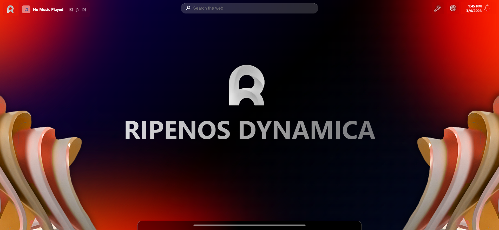

# Ripen OS Dynamica
**RipenOS Dynamica** , a member of the [RGOS](https://ripenos.github.io/) family, is an open source concept Operating System which inherits an advance fluid GUI and filled with dynamic functionalities.

## **Coming soon ✨✨**

### 🚧 This project is still under progress.

## ⚖️ License
**MIT License** | Licensed as **Copyright (c) 2022 RipenOS**

Developed by [Navaneet](https://github.com/navaneet239) | Maintained by [RGOS](https://github.com/ripenos)
