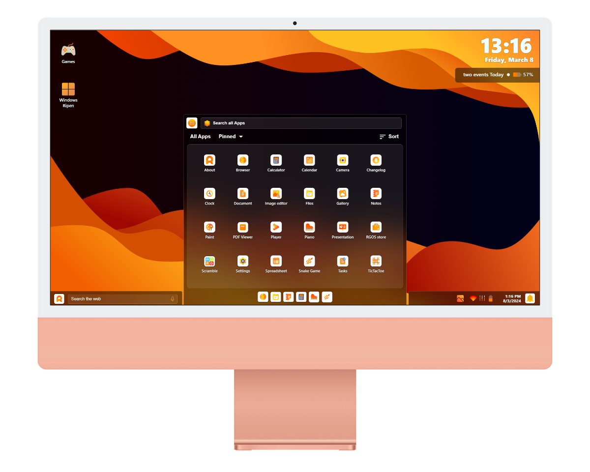
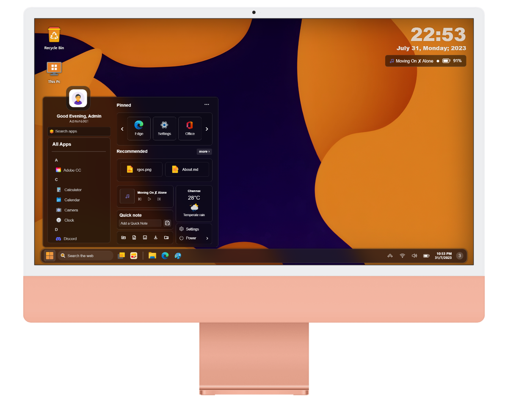
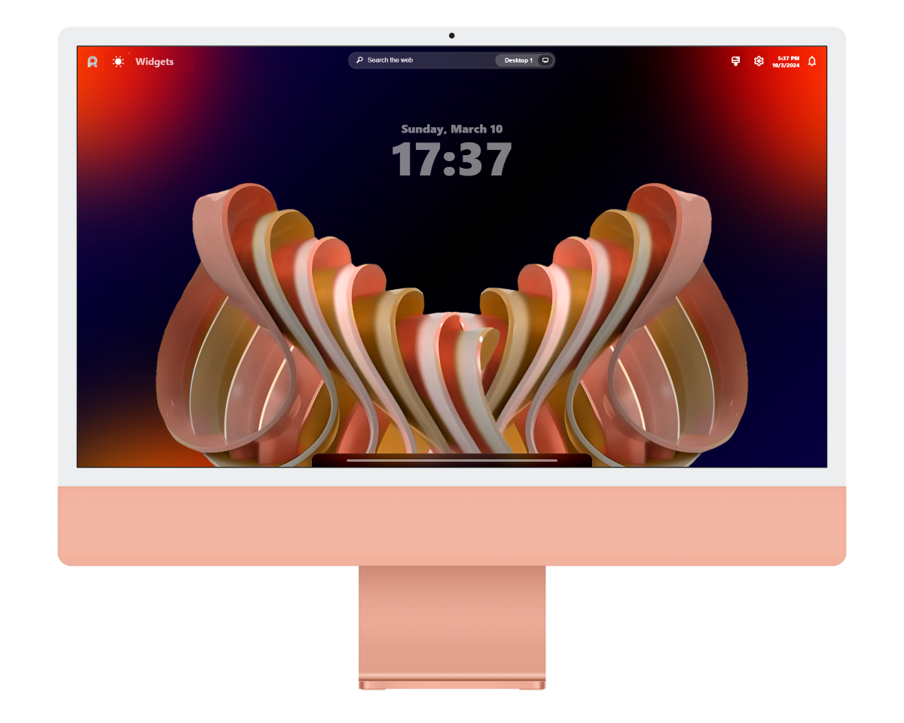

 <h1 align="center">Ripen Group of Operating Systems</h1>
 

<a href="LICENSE">LICENSE</a> • <a href="Docs/Changelog.md">What's Happening</a> • <a href="Docs/Credits.md">credits we are thanking for</a> • <a href="CODE_OF_CONDUCT.md">Code of Conduct</a> • <a href="Docs/Evolution.md">Evolution of RGOS</a>

 

 

<h2 align="center">ℹ️ About</h2>

RGOS is an open-sourced, web based OS Family concept built with just Vanilla HTML-CSS-JS. RGOS follows a very modern, sleek, and orange themed GUI. Remember, this project and its members are not fully functional operating systems but a concept trying to fulfill the experience of a desktop... Check <a href="[Docs/Evolution.md](https://github.com/ripenos/ripenos.github.io/wiki)">Wiki</a> for more info...
<h3 align="center">Latest release: <a href="https://ripenos.github.io">v5.0 bundled launch</a></h3>

 

<h1 align="center"><a href="https://ripenos.github.io/Ripenos">Ripen OS</a> v4.0</h1>

<b>Head of the Family</b> • Where triplets and its productivity come in handy!

<h1 align="center"><a href="https://ripenos.github.io/WinRipen">Windows Ripen</a> v1.3</h1>

1st member of the family • A new taste of the Windows Operating system

<h1 align="center">Ripen OS Dynamica</h1>

A dynamic Scenery • Coming soon in the RGOS family

Note ❗: Windows Ripen isn't in anyway affiliated with Microsoft and should not be confused with Microsoft’s Operating System or Products. This is not a Windows 365 cloud PC.

 

 <h1 align="center">🖼️ Gallery</h1>

<h3 align="center">Ripen OS</h3>

| Computer | Mobile          |
| ------- | ------------------ |
|  | |
<h3 align="center">Windows Ripen</h3>

| Computer | Mobile          |
| ------- | ------------------ |
|  |  |

 

<h1 align="center">🎒 Resources</h1>
<h3 align="center"><a href="https://ripenos.github.io/ripen.css/">Ripen.CSS framework</a></h3>

RGOS Framework are the set of stylesheets for building interface components that look like the RGOS

 

<h1 align="center">❓ Questions</h1>

| Questions | Answers          |
| ------- | ------------------ |
| **Does your project contain Full working Operating System?** |Not yet, but it gives you the experience of a desktop!|
| **Does it contain any UI library/Framework?** | Yes, library called the [Ripen.css](https://ripenos.github.io/ripen.css/).|
| **Can I contribute?** |Yes! Send an Issue, Pull a request and fill in the contribution form provided in [CONTRIBUTING.md](CONTRIBUTING.md).|
| **Are there apps in it?** | Yes! Native apps are present to enhance your working experience. |

 

<h1 align="center">⚖️ License</h1>
<h3 align="center"><a href="LICENSE">MIT License | Licensed as Copyright (c) 2022 RipenOS</a></h3>

Developed by <a href="https://github.com/navaneet239">Navaneet.J</a> and team. | Maintained by <a href="https://github.com/ripenos">RGOS</a>

